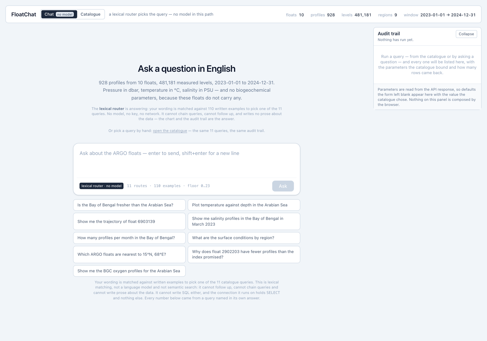
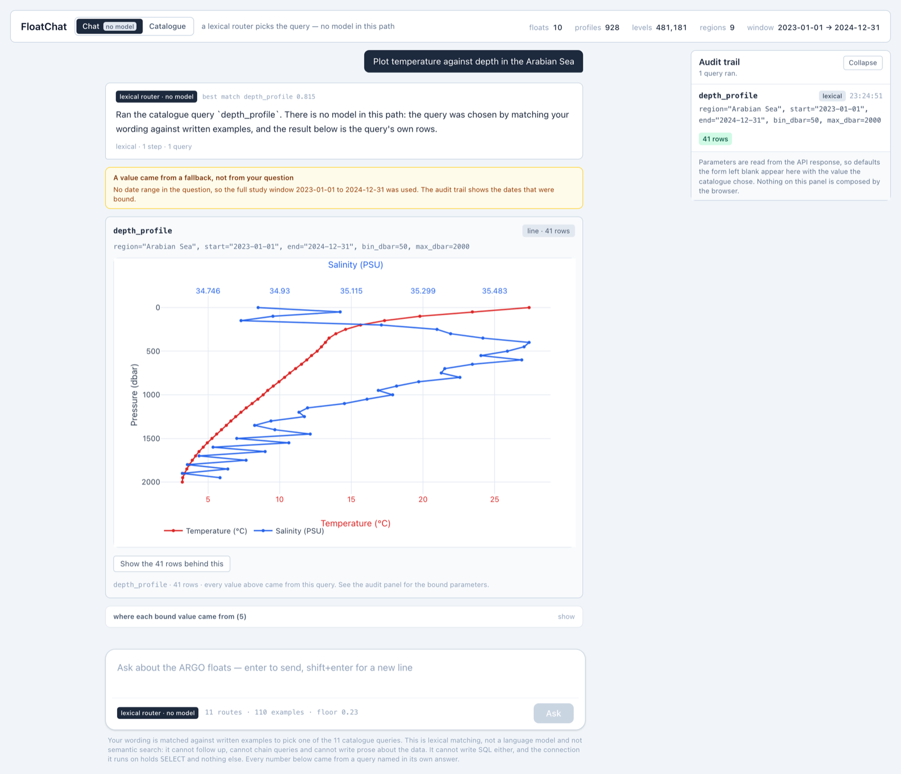
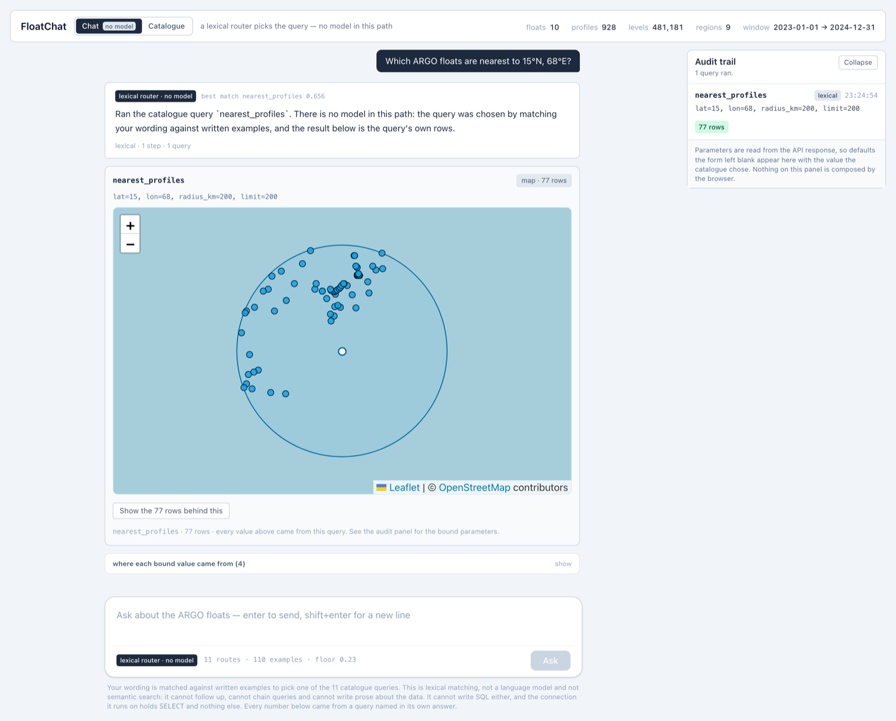
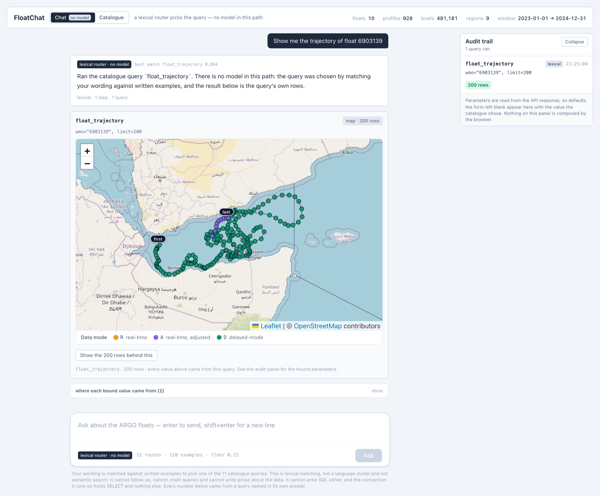

# FloatChat

Ask questions in English about ARGO ocean float data, and get answers that can
be traced back to the exact query that produced them.

The pipeline pulls the global ARGO index from the GDAC, narrows 3.4 million
profile records down to a defensible demo set, parses the NetCDF files with the
QC and calibration rules the data actually requires, loads them into Postgres
with real IHO region boundaries, builds a FAISS index over summaries the
database generates about itself, and puts a model-driven query layer on top
that **cannot write SQL**.

Every non-obvious choice, its alternatives, and why — including the ones that
turned out to be wrong — is in [DECISIONS.md](DECISIONS.md).

---

## What it looks like

Four frames from the dashboard, captured from the production bundle running
against the local database — headless Chrome driven over the DevTools
Protocol, through the same `ui/test_render.py` harness the check suite uses,
with the API proxied onto the page's own origin. Nothing below is a mockup:
every number in them came out of Postgres when the frame was taken.

**The landing screen.** It opens in Chat with no key and no model. The nine
preset questions are not copy — `ui/test_render.py` reads them off the
rendered page on every run, asks `/ask` each one, and prints the misses:



**A question that becomes a chart.** The router names the query it picked and
the score it matched at, the audit trail lists the parameters the catalogue
bound, and the yellow panel says out loud that the date range was a fallback
rather than something the question asked for. Pressure increases downward, in
dbar; temperature is °C and salinity PSU, on their own axes:



**A question that becomes a map.** `nearest_profiles` bound `lat=15, lon=68,
radius_km=200, limit=200` and returned 77 rows — the circle is the radius that
was actually queried, not a decoration:



**One float's life.** The earliest 200 of float 6903139's 289 fixes, coloured
by `DATA_MODE`. The legend carries all three states because `DATA_MODE` has
three; these 200 hold two of them — 191 delayed-mode and 9 real-time-adjusted,
which is the green track and the short purple run just before `last`:



Every one of those four screens names the query that produced it, in the
answer, in the audit trail and in the footer under the chart. That is the whole
point of the project: there is no number on the page that cannot be traced to a
query and its bound parameters.

---

## Quickstart

Needs Python 3.13 and a running PostgreSQL (14 or later). No Docker, no
PostGIS, no GDAL.

```bash
python -m venv .venv
.venv/bin/pip install -r requirements.txt
.venv/bin/python run_pipeline.py
```

That downloads ~155 MB, builds the database, builds the retrieval index, and
runs 544 checks. First run is a few minutes, mostly transfer; afterwards it
re-runs from cache in about 11 seconds.

Then apply the read-only role the query layer uses, once:

```bash
psql -h localhost -d floatchat -f db/roles.sql
```

To ask questions in English you need a key for **either** provider — the same
tool loop runs on Anthropic or Gemini behind one transport seam. **Everything
else works without either key**, including the dashboard, the retrieval index
and every test suite:

```bash
export ANTHROPIC_API_KEY=...          # or: export GEMINI_API_KEY=...
.venv/bin/python api/chat.py "how salty is the Bay of Bengal compared to the Arabian Sea?"
.venv/bin/python api/chat.py --gemini "which float went deepest?"
.venv/bin/python api/chat.py --models  # what a Gemini key can actually reach
```

Whichever key is present is used; `--anthropic` / `--gemini` force the choice
and `--model=NAME` overrides the model.

**The whole dashboard needs no key at all**, and since Stage 16 it does not
ask for one: it opens in **Chat**, where a **lexical router** — written
examples, no model, no network — picks one of the eleven queries and every
reply is badged `lexical router · no model`. **Catalogue**, one click away, is
the same eleven queries with dropdowns built from the database. Either way you
see which query ran, the parameters the catalogue bound, and the chart drawn
from the rows that came back. The model path is still there and still tested;
it is reached through `/ask` with an explicit `provider`, or from `api/chat.py`
above — not from the dashboard:

```bash
.venv/bin/uvicorn api.server:app --port 8000     # one terminal
cd ui && npm install && npm run dev              # another; opens :5173
```

The retrieval index builds with no key either, and reports how well it works:

```bash
.venv/bin/python etl/build_index.py              # 131 documents, ~0.3s
.venv/bin/python api/retrieval.py                # recall@1/3/5 and MRR
```

---

## What you get

| | |
|---|---:|
| floats | 10 |
| profiles | 928 |
| measured levels | 481,181 |
| date range | 2023-01-02 .. 2024-12-31 |
| depth range | 0 .. 2052 dbar |
| named regions | 9 (IHO S-23, MRGID recorded) |
| database size | 95 MB |
| parameterised queries | 11 |
| indexed summaries | 131 |
| automated checks | 544 |

The ten floats are deliberately mixed: 6 delayed-mode, 2 real-time-only, 2 that
change mode mid-life; 4 data centres of which 5 floats are Indian (`incois`);
6 profiler types; the Arabian Sea, the Bay of Bengal and the equatorial band.
`etl/demo_floats.py` re-checks every one of those claims on each run and fails
if one stops holding.

---

## How it fits together

```
GDAC index (3,397,664 rows)
  └─ etl/fetch_index.py    download + cache the 58 MB gzipped index
  └─ etl/filter_index.py   → 12,372 profiles, 254 candidate floats
       └─ etl/demo_floats.py    → the 10-float demo set, with reasons
            └─ etl/fetch_profiles.py   → 10 NetCDF files, verified against the index
                 └─ etl/parse_profiles.py  → profiles.csv + levels.csv
                      └─ etl/fetch_regions.py  → IHO polygons, simplification proven lossless
                           └─ etl/load_db.py   → Postgres, 21 verification checks
                                └─ api/catalog.py  11 parameterised queries (read-only role)
                                     ├─ api/corpus.py   131 summaries, each generated by a query it carries
                                     │    └─ api/embed.py + api/retrieval.py  FAISS, exact cosine
                                     ├─ api/chat.py     the model picks a query and fills its parameters
                                     │    ├─ Anthropic (claude-opus-5)
                                     │    └─ api/gemini.py  the same loop on Gemini
                                     └─ api/server.py   GET /meta, POST /query, POST /ask
                                          └─ ui/        the dashboard: Chat and Catalogue, one audit trail
```

`api/catalog.py` feeds two consumers from the same objects: the model's tool
schemas and the dashboard's dropdowns. The choices a human can pick and the
enums a model is offered are the same list by construction, and a test compares
them element by element.

`db/schema.sql` holds six tables. Four hold data; two exist because the project
forbids silent dropping — `dropped_profiles` records every profile the pipeline
refused and why, and a one-row `ingest_run` states the database's own
provenance.

---

## Retrieval: what it does, and what it is not allowed to do

The vector index holds **131 documents in seven kinds** — one per region, one
per region-month, one per float, one per catalogue query, a glossary of the
domain traps, the profiles the pipeline refused, and the dataset itself. Every
one is **generated from a SQL query, and stores that query**. The dashboard
shows the SQL under each retrieved note, so a summary that steered an answer
can be re-run.

The retrieved notes are put in front of the question so the model knows which
of the eleven queries to reach for and what to put in it. They are **not
allowed to become the answer**: the system prompt says every number must come
from a tool result in that conversation even when a note appears to contain it,
because a summary can be stale and a query result cannot. What enforces that is
the prompt plus the audit trail, which says "no query was run" when nothing ran
— it is stated here rather than overclaimed.

Retrieval is measured, not asserted. Eighteen fixed questions with the
documents that should come back:

| | |
|---|---:|
| recall@1 | 77.8% |
| recall@3 | 88.9% |
| recall@5 | 94.4% |
| MRR | 0.835 |

One question misses and it stays in: *"how were the region boundaries
decided?"* does not find the regions glossary, because the shipped keyless
embedder is lexical and has no path from "decided" to "IHO S-23".
`build_index.py` prints the miss on every run.

---

## Why the query layer is built this way

The language model never writes SQL. It is given 11 hand-written parameterised
queries as tools and chooses one, filling typed parameters. Four consequences,
none of which depend on the model behaving:

- **No injection surface.** No string the model produces reaches the SQL.
- **No destructive statement to emit.** None exists in the catalogue.
- **A hallucinated region is unrepresentable.** The tool schema's enums are read
  from the database at startup, and a value outside them is rejected with the
  valid list — which the model then uses to correct itself.
- **The connection cannot write.** `floatchat_ro` holds `SELECT` and nothing
  else. A `DELETE` is refused by Postgres, not by a prompt.

Every answer returns its audit trail: which queries ran, with which bound
parameters, and how many rows each returned.

---

## What is verified

```bash
.venv/bin/python run_pipeline.py --check
```

- **125 retrieval checks** — the corpus reconciled against the database it was
  generated from (a glossary sentence must carry the count the table holds, an
  empty region must still get a document that says it is empty, a NULL must
  never render as 0.00); the embedders' normalisation, batching and asymmetric
  task types; the same text embedding identically **in a different process with
  a randomised hash seed**, which `hash()` would fail; an index round-tripping
  through disk with its fitted weights and returning the same hits; recall
  floors on the shipped dimensionality, with the narrower one asserted to be
  worse; the notes reaching the model as labelled summaries while the cached
  system prefix stays byte-identical; a broken index costing the notes and not
  the answer; and `/ask` end to end on a scripted transport, rows attached.
- **21 database checks** — row counts against the CSVs, orphan levels, profiles
  with no levels, level counts disagreeing with their profile, pressures out of
  range, profiles outside the declared window, and the region assignment
  cross-checked against an independent Python implementation.
- **28 query-layer checks** — every query against its documented example, plus
  eight hostile inputs (an injection string, an unknown region, `"last tuesday"`
  as a date, a limit of ten million) that must be refused *with the valid values
  named*, plus four write statements Postgres must reject.
- **28 tool-loop checks** — the whole Claude loop with no API key and no
  network: request shape, parallel tool results returned in one message, a
  refused parameter round-tripping and recovering, questions outside the data
  running no query at all.
- **45 Gemini-adapter checks** — the translation in both directions against
  real `google.genai.types` objects, so a schema Gemini's own models would
  reject fails in the suite rather than in the demo.
- **62 HTTP API checks** — `/meta` compared against the catalogue and the
  database directly, so hardcoding a region list into the server fails the
  suite; the dashboard's choices compared element by element against the
  model's tool enums; the eight hostile inputs again over HTTP; `numeric`
  arriving as a number rather than a string; an aggregate over nothing
  reporting `null` rather than `0.0`; and a stopped database returning 503
  with its reason instead of an empty body.
- **53 deployment-configuration checks** — the two requirements freezes
  reconciled pin by pin, and the property behind them: no third-party module
  imported anywhere under `api/` is missing from the slim one. Then both upload
  sets, *computed by walking the tree* rather than grepping the ignore files —
  the API's (1.1 MB, 26 files) and the dashboard's (0.25 MB, 24 files) — each
  asserted to carry the retrieval index and no credential and no `node_modules`.
  Then the git tree as its own deploy path, because a push deploys from it and
  it must carry what the CLI carries. Then `.env.example` compared against every
  `os.environ` read in the code **both ways**, so a variable added to one and
  not the other fails here rather than during a demo, and every example value
  checked against the shapes of a real key. And last, with a fabricated model
  key in the environment, that the vector index is still searched by the
  embedder recorded in its own manifest — which withdrew a limitation this
  project had documented and never re-checked (D17.10). None of it needs a
  network, a database or a Vercel account.
- **The funnel reconciles.** 939 profiles promised by the index − 13 dropped by
  QC + 2 the index's box filter had excluded = 928 written. Every one of those
  15 has a name and a reason in `dropped_profiles`.
- **The ocean checks out.** Mean 0–10 dbar salinity comes out Bay of Bengal
  32.87 < Arabian Sea 35.43 < Gulf of Aden 36.29 — river discharge at one end,
  Red Sea outflow at the other. Nothing told the pipeline to produce that
  ordering, and it is asserted as a test.

---

## Deploying it

`DEPLOYMENT.md` is the whole thing, step by step. The short version:

| tier | where | why |
|---|---|---|
| dashboard | Vercel, root directory `ui` | static Vite build |
| API | Vercel, root directory `.` | one Python function, `api/index.py` |
| database | Supabase Postgres, **pooled** connection string | 96 MB against a 500 MB free tier |

Both Vercel projects import the same GitHub repository, so one push deploys
both. Three environment variables — `FLOATCHAT_DSN`, `FLOATCHAT_ORIGINS`,
`VITE_API_BASE` — and `.env.example` is the list.

**Render and Railway were considered and are documented as the fallback.** The
deciding argument was not cost: Render's free instance sleeps after 15 minutes
and takes about 50 seconds to wake, and a blank page in front of judges is the
failure this project is organised against. Nothing here needs a GPU service —
the dashboard's answering engine runs inside the API process with no model.

**The API is live at `argo-rose.vercel.app` and has no database behind it.** It
boots, routes, and returns `503` naming the address it tried. That is Stage 15;
Step 1 of `DEPLOYMENT.md` is what makes it answer a question about ARGO.

---

## Known limitations

- **Nothing in this repository has been run against the deployed stack.** The
  configuration for all three tiers is written and checked by 53 assertions, and
  every one of them checks *this repository* — none can check Vercel or
  Supabase. No hosted database has been created from here, no environment
  variable has been set, no push has been deployed. `DEPLOYMENT.md` marks every
  step that needs a person, and its last section lists what is still unproven
  after they are all done — including the cold start of `/ask`, and the fact
  that `catalog.connect()` still opens a connection per query, which the pooled
  connection string makes survivable rather than solved.
- **The keyless chat path is a lexical router, not a language model.** It
  matches your wording against 110 written examples to pick one of the eleven
  queries. It cannot follow up, cannot chain queries and writes no prose about
  the data — the chart and the audit trail are the answer. Measured over 58
  fixed questions: **false-accept rate 0.0%, refusal recall 100%, routing
  accuracy 66.7%.** That last number is the ceiling of the method: a third of
  legitimate paraphrases are refused, and the 11 misses print on every run.
- **Nothing here has been run against a live model or a live embedding API.**
  The `GEMINI_API_KEY` in this environment is the placeholder `YOUR_REAL_KEY`
  and the API rejects it; there are no Anthropic credentials on this machine.
  The Gemini embedder and `POST /ask` are tested against recording fakes, which
  proves the translation and not the transaction. **Every retrieval number
  above is the keyless lexical embedder's.** A working key changes this in
  minutes; until then it is unproven and listed here first.
- **The shipped embedder is lexical, not semantic.** With no key, embedding is a
  bag of hashed word and character n-grams weighted by inverse document
  frequency. That is real retrieval and it is weak: it cannot match a synonym,
  which is exactly the miss printed above. `gemini-embedding-001` is wired and
  is what runs when a key exists. Nothing in this project calls the local one
  semantic search.
- **The vector index is a file, not a table.** It lives under `data/rag/` and is
  not transactional with the database it summarises, so a reload can leave a
  stale index behind. `/meta` reports the index's build time so staleness is
  visible; making it impossible would mean rebuilding from `load_db.py`, and
  that is not done.
- **Asked for by the problem statement and not built:** MCP, Parquet output, and
  ASCII/NetCDF export of query results. Also missing are a depth-time
  (Hovmöller) plot and a multi-profile comparison display. These are absences,
  not stubs — there is no half-built version of any of them in the tree.
- **The routing is observed on Gemini, unmeasured everywhere.** Eight real
  questions on `gemini-3.6-flash` chose the right query eight times, and the
  three that fell outside the data ran no query at all. That is a demo, not an
  evaluation: there is no fixed question set with expected query names and no
  pass rate. On Anthropic it is worse than unmeasured — there are no Anthropic
  credentials on this machine, so the loop has never made a live call there at
  all, only scripted ones.
- **What is proven is proven on a flash model.** The available Gemini key has
  no free-tier quota for any pro model (`429`, `limit: 0`), so
  `gemini-3.6-flash` is the default and the only tier the routing has been
  seen on.
- **Ten floats, two years, one ocean basin.** The scope is deliberate and
  documented, not a stub. Widening it means re-running Stage 1 with different
  constants and re-checking the funnel.
- **The dashboard is read back on every run; how it *looks* is still not
  checked.** Of the 544 checks, 44 (`ui/test_ui.py`) read the UI source and
  assert what has already been broken here at least once: every query has a
  display and no display is stale, `displays.js` is still the only UI file
  naming a query in code, no Plotly attribute that this pinned version silently
  drops, no map marker depending on an image file, three data modes, units
  declared, every suggestion filled from a real catalogue example, and the tab
  badge naming the engine that would actually answer. They need no database, no
  npm and no browser. A further 53 (`ui/test_render.py`) drive the *production
  build* in headless Chrome and read the result back — the computed axis
  colours, that pressure increases downward on the drawn axis, that no request
  404s, that the page opens in the chat tab and the catalogue is one click
  away. **What none of them can see is whether anything looks right** — a
  legend that overlaps, a layout that breaks in a narrow window, two labels on
  top of each other. One browser, one viewport, and no screenshot is compared
  against anything.
- **The dashboard no longer exercises the model path at all.** Stage 16 removed
  it from the UI (D16.8) because on this machine the key is a placeholder and
  the button failed on every click. A model choosing a catalogue query is
  therefore demonstrated by `api/chat.py` and by `/ask`, both of which are
  tested — and neither of which has been run against a live key from here.
- **Core ARGO only.** Pressure, temperature, salinity. No biogeochemical
  parameters — the ten floats do not carry them.
- **Region polygons drop island holes and are simplified** to fit a core
  Postgres `polygon`. Proven to change no profile's region in this dataset, and
  re-proven on every run, but it is a simplification and it is recorded as one.
- **Two profiles sit just outside the declared study box** (float 2903143 drifted
  to 10.6°S). They are kept and flagged `in_study_box = false` rather than
  clipped mid-trajectory.

---

## Layout

```
etl/              the pipeline, one script per stage, each prints its own report
etl/build_index.py  Stage 11: build the vector index and report its recall
api/catalog.py    the 11 parameterised queries + their tool schemas
api/chat.py       the tool loop, provider-agnostic
api/gemini.py     the same loop on Gemini, behind the same seam
api/corpus.py     the 131 summaries, each generated by a query it carries
api/embed.py      three embedders behind one seam (Gemini · keyless · scripted)
api/retrieval.py  the FAISS index, and the measurement of whether it works
api/router.py     Stage 12: picks a query with no model, and measures itself
api/server.py     GET /meta, GET /regions.geojson, POST /query, POST /ask
api/test_*.py     444 checks, no network, no API key
ui/               the dashboard; ui/src/displays.js maps each query to a chart
db/schema.sql     tables, constraints, indexes
db/roles.sql      the read-only role
run_pipeline.py   runs everything, skips what is already built
vercel.json       the API's Vercel project: one build, one route
ui/vercel.json    the dashboard's: vite, static, its own project
.env.example      every variable the code reads, names only, checked both ways
DEPLOYMENT.md     the three tiers, step by step, and every failure's message
CLAUDE.md         the working agreement and the ARGO domain rules
DECISIONS.md      every choice and why — the long version
```
